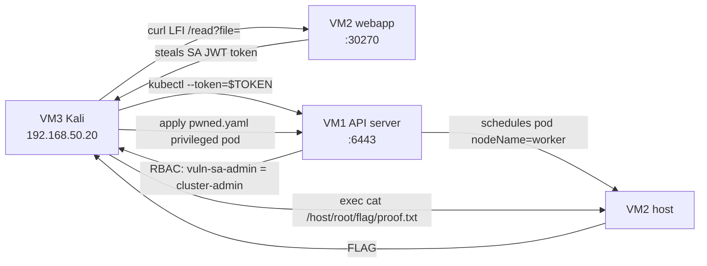

# K8s-Guard

> **Attack. Detect. Harden.** A 60-minute hands-on Kubernetes security lab where
> you play both attacker and defender against a vulnerable k3s cluster. You chain
> an LFI into a full cluster takeover, catch it in Falco + Security Onion, then
> harden the cluster per the NSA/CISA Kubernetes Hardening Guide.

A self-contained lab on *Threat Detection & Monitoring in Kubernetes using the
NSA/CISA Kubernetes Hardening Guide, feeding data into Security Onion.*

---

## What this lab teaches

You walk one complete exploit path end-to-end, wearing a few different hats:

1. **Attack.** Turn a web app's Local File Inclusion bug into theft of a
   Kubernetes service-account token, use that token to reach the API server,
   find an over-permissive `cluster-admin` binding, deploy a privileged pod,
   and escape to the host to capture a flag.
2. **Detect.** Now switch to defender. Investigate the attack in Security Onion
   (Kibana) using two telemetry streams: Kubernetes audit logs (API activity)
   and Falco runtime alerts (in-container syscalls).
3. **Harden.** Remediate with least-privilege RBAC and Pod Security Standards,
   mapped to the NSA/CISA Kubernetes Hardening Guide v1.2.

The core lesson: misconfigurations, not zero-days, are the #1 K8s attack
vector, and the right controls limit the blast radius even when the app stays
vulnerable.

---

## The attack chain

```
                        ┌──────────────────────────────────────────────────┐
                        │              THREE CHAINED MISCONFIGS             │
                        │  (1) LFI   (2) RBAC=cluster-admin   (3) no PSS    │
                        └──────────────────────────────────────────────────┘

  VM3 Kali            VM2 Worker (webapp)         VM1 Master (API)      VM2 Worker (host)
 192.168.50.20        192.168.50.11:30270        192.168.50.10:6443
     │                       │                          │                    │
     │  curl /read?file=     │                          │                    │
     │  ...serviceaccount/   │                          │                    │
     │─────token────────────▶│                          │                    │
     │◀──── JWT token ───────│                          │                    │
     │                       │   kubectl --token=$TOKEN │                    │
     │──────────────────────────────────────────────── ▶│  get nodes / RBAC  │
     │                       │   found: ClusterRoleBinding vuln-sa-admin      │
     │                       │          = cluster-admin │                    │
     │   kubectl apply -f pwned.yaml (privileged pod)   │                    │
     │──────────────────────────────────────────────── ▶│─── schedule ──────▶│
     │   kubectl exec pwned -- cat /host/root/flag/proof.txt                  │
     │──────────────────────────────────────────────────────────────────────▶│
     │◀────────────  FLAG{k8s_privilege_escalation_successful}  ──────────────│

   LFI opens the door, RBAC hands over the keys, and no PSS lets the attacker walk out.
```

<details>
<summary>Same diagram as Mermaid</summary>


</details>

---

## Repo layout

```
k8s-guard/
├── README.md                     ← you are here
├── docs/                         ← original source material (unmodified)
│   └── K8s_Guard_Full_Project_Documentation.md
├── manifests/                    ← vulnerable-cluster Kubernetes YAML
│   ├── 00-namespace.yaml                     vuln-app namespace (no PSS = Vuln 3)
│   ├── 01-serviceaccount-vuln-sa.yaml        vuln-sa service account (token target)
│   ├── 02-clusterrolebinding-vuln-sa-admin.yaml  vuln-sa → cluster-admin (Vuln 2)
│   ├── 03-webapp-pod.yaml                     Internal Document Portal w/ LFI (Vuln 1)
│   └── 04-webapp-svc.yaml                     NodePort webapp-svc on 30270
├── attack/                       ← attacker's perspective
│   ├── ATTACK.md                             numbered attack-chain walkthrough
│   └── pwned.yaml                            privileged attack pod
├── detection/                    ← defender's perspective (Security Onion)
│   ├── DETECTION.md                          audit + Falco investigation guide
│   ├── k3s-audit-config.yaml                 K8s audit logging config (VM1)
│   ├── filebeat-vm1-audit.yml                ships audit logs → Elasticsearch (redacted)
│   └── filebeat-vm2-falco.yml                ships Falco alerts → Elasticsearch (redacted)
└── hardening/                    ← remediation (NSA/CISA guide)
    ├── HARDENING.md                          3 fixes mapped to NSA/CISA sections
    ├── hardened-role.yaml                    least-privilege Role (get/list pods)
    ├── hardened-rolebinding.yaml             binds Role to vuln-sa (namespace-scoped)
    └── namespace-hardened.yaml               vuln-app + restricted PSS label
```

## Quickstart

- **Attackers:** start at [`attack/ATTACK.md`](./attack/ATTACK.md). Every
  command, in order, from Kali.
- **Defenders:** go to [`detection/DETECTION.md`](./detection/DETECTION.md) for
  how to find the attack in Security Onion / Kibana.
- **Hardeners:** go to [`hardening/HARDENING.md`](./hardening/HARDENING.md) for
  the three fixes and their NSA/CISA mappings.
- **Full context:** [`docs/K8s_Guard_Full_Project_Documentation.md`](./docs/K8s_Guard_Full_Project_Documentation.md).

---

## MITRE ATT&CK mapping

